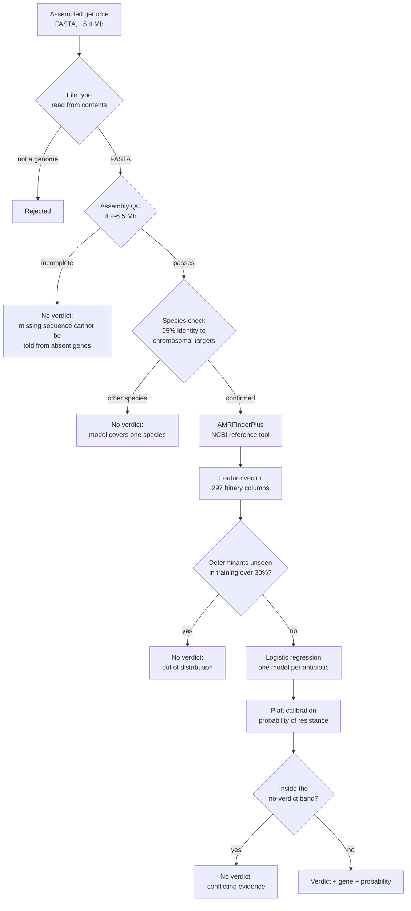
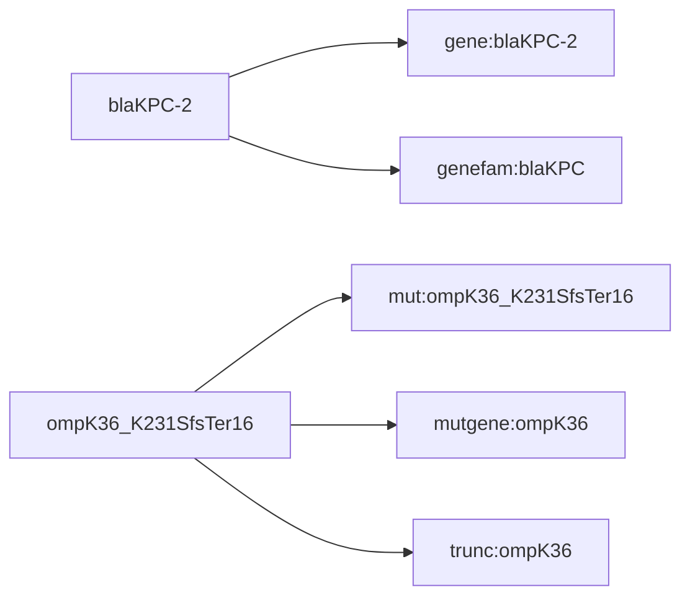
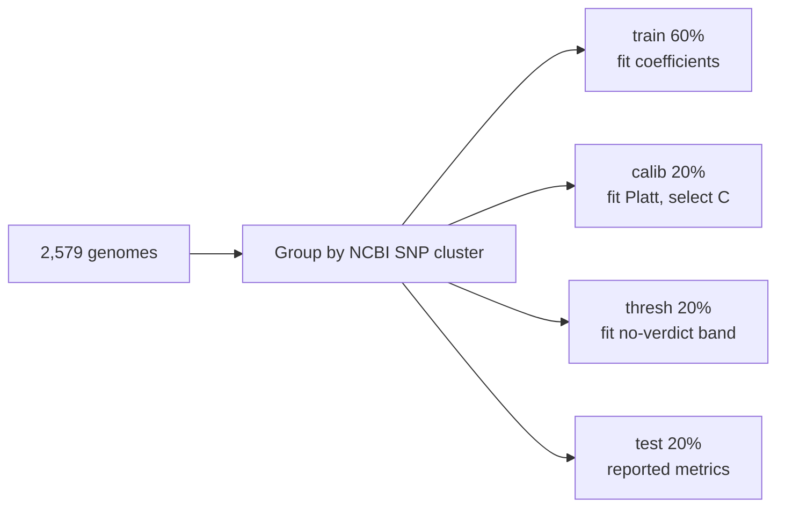

# Genome Firewall

Predicts, from one assembled bacterial genome, whether each of five antibiotics is
already defeated by resistance genes the organism carries.

Species: *Klebsiella pneumoniae*. Antibiotics: ceftriaxone, ciprofloxacin,
gentamicin, meropenem, trimethoprim/sulfamethoxazole. Every result carries the gene
that produced it, a calibrated probability, and the option of returning no verdict.

**Research prototype. Not validated for clinical use. Every result requires
confirmation by standard laboratory susceptibility testing.**

```bash
uv sync --extra train                    # dependencies from uv.lock
uv run python scripts/acceptance.py      # 25 checks, all pass
make app                                 # http://localhost:8501
```

---

## 1. What the system does

Laboratory susceptibility testing takes one to three days. The genome is available
within hours of sequencing and already contains the resistance genes. This system
reads those genes and reports which antibiotics they defeat.

It begins after assembly and ends at a report. It does not process samples,
sequence DNA, assemble genomes, identify species, or separate mixed samples. It
does not design or modify organisms.

| | |
|---|---|
| Training genomes | 2,579 |
| Laboratory measurements | 9,186 |
| Features | 297 binary presence/absence |
| Model | L1 logistic regression, one per antibiotic |
| Held-out AUROC | 0.893 ± 0.019 over 8 independent splits |
| Held-out balanced accuracy | 0.789 ± 0.014 |

---

## 2. Pipeline



Four independent checks can stop a verdict before the model runs. Each was added
after a measured failure, listed in section 6.

### Feature extraction

AMRFinderPlus reports resistance genes and point mutations. Raw symbols are too
fine-grained to learn from directly, so three rollups are added:



| Prefix | Meaning | Why it exists |
|---|---|---|
| `gene:` | exact allele | direct AMRFinderPlus output |
| `genefam:` | allele family | `blaKPC-2` and `blaKPC-3` are the same enzyme; L1 kept one and zeroed the other |
| `mut:` | exact mutation | direct output |
| `mutgene:` | any mutation in that gene | 294 distinct point mutations exist, 73% seen fewer than 3 times |
| `trunc:` | frameshift or truncation | `ompK35` is hit 746 times across 75 variants; porin loss is a distinct mechanism |
| `class:` | drug-class rollup | coarse grouping |

Features present in more than 95% of genomes are dropped. A binary feature with
prevalence *q* has variance *q*(1−*q*), so at *q* = 0.999 it is a constant and acts
as a second intercept.

---

## 3. The model

One binary classifier per antibiotic. For a genome with feature vector
*x* ∈ {0,1}²⁹⁷:

```
log( p / (1 - p) )  =  β₀ + Σᵢ βᵢ · xᵢ
```

Each gene shifts the log-odds of resistance by a fixed amount βᵢ. Equivalently,
carrying gene *i* multiplies the odds of resistance by exp(βᵢ). For meropenem,
β = 4.87 on `genefam:blaNDM`, so a genome carrying NDM has e⁴·⁸⁷ ≈ 130 times the
odds of resistance.

### Fitting

**L1 penalty.** The objective is

```
minimise   Σₙ wᵧ · loss( yₙ , βᵀxₙ )   +   (1/C) · ‖β‖₁
```

The L1 term drives most coefficients to exactly zero, leaving 8–30 genes per
antibiotic out of 297. `w` is the class weight, set inversely to class frequency.

**C is selected on a calibration block**, never on training data and never on test,
using AUROC and a half-standard-error rule: the sparsest model whose score is
within half a standard error of the best.

**Platt calibration.** The raw score is mapped to a probability by

```
p = σ( a · βᵀx + b )
```

fitted on a third block. This preserves the logistic form, so exp(a·βᵢ) remains an
odds ratio after calibration. Isotonic regression was tested and rejected: it is
non-parametric, the calibration blocks hold 114–190 rows, and it collapsed the
output onto about 15 distinct probabilities with a third of all samples tied on one
value. Over 10 paired splits it lost on Brier (0.214 against 0.203), on expected
calibration error, and on AUROC (0.749 against 0.763), because ties forfeit ranking
credit.

### Data splitting



No SNP cluster spans two blocks. Four blocks rather than three because the
no-verdict threshold must not be selected on the rows the calibrator was fitted on;
doing so reported a recall of 1.000 that delivered 0.971 held out.

Split quality was verified three ways. No cluster appears on both sides. A
classifier trained to predict split membership from features reaches AUROC 0.467,
so the splits are exchangeable. Grouping additionally by identical feature profile
changes AUROC by −0.003 (t = −0.20).

### No verdict

Three independent conditions return no verdict:

| Condition | Trigger |
|---|---|
| Conflicting evidence | calibrated probability inside a band fitted per drug |
| Out of distribution | over 30% of detected determinants absent from training |
| Deterministic gate | drug target gene absent, or species or assembly check failed |

The band is fitted per drug on the threshold block by widening outward from 0.5
until accuracy on the calls made reaches 90%, capped at a 30% no-verdict rate. A
fixed 0.40–0.60 band was rejected: the fitted bands range from 0.45–0.55 for
ceftriaxone to 0.24–0.76 for gentamicin.

---

## 4. Data

| Source | Contribution | Link |
|---|---|---|
| NCBI Pathogen Detection | AMRFinderPlus genotypes, AST phenotypes, SNP clusters | [snapshot PDG000000012.2470](https://ftp.ncbi.nlm.nih.gov/pathogen/Results/Klebsiella/) |
| BV-BRC | additional lab-measured phenotypes | [bv-brc.org](https://www.bv-brc.org/) |
| AMRFinderPlus | annotation tool and reference database | [github.com/ncbi/amr](https://github.com/ncbi/amr) |
| K. pneumoniae HS11286 | reference alleles for the target gate | [GCF_000240185.1](https://www.ncbi.nlm.nih.gov/datasets/genome/GCF_000240185.1/) |

Reproduce the dataset:

```bash
uv run python -m gfw.merge_sources --organism Klebsiella
```

**Label policy.** Only phenotypes measured in a laboratory are used:
`laboratory_typing_method` must be broth dilution, MIC, disk diffusion, agar
dilution or Etest. NCBI carries 11,074 records marked "Computational prediction"
for this species; they are excluded. `Intermediate` is dropped rather than folded
into either class. Where two sources disagree for one genome-drug pair, the pair is
dropped.

**Source composition.** 1,992 genomes come from NCBI directly; 587 are BV-BRC
phenotypes joined to NCBI genotypes by assembly accession with the version
stripped. On a same-test-set comparison over 10 paired splits the additional data
is worth +0.0095 AUROC (t = 3.51, better on 10 of 10 splits).

On the 872 overlapping (assembly, drug) pairs the two sources agree 100%. This is
not evidence of label quality: the sources are not independent and share
provenance. Label noise cannot be estimated from this comparison.

---

## 5. Results

Measured on genomes absent from training, grouped by SNP cluster, averaged over 8
independent splits.

| Antibiotic | n | Resistant | Genes used | AUROC | Balanced accuracy | PR-AUC | Brier | Recall (R) | Specificity | No verdict |
|---|---|---|---|---|---|---|---|---|---|---|
| Meropenem | 1,884 | 46% | 21 | 0.909 ± 0.023 | 0.807 ± 0.035 | 0.868 | 0.121 | 0.844 | 0.770 | 23% |
| Ceftriaxone | 1,922 | 55% | 22 | 0.909 ± 0.020 | 0.794 ± 0.037 | 0.912 | 0.126 | 0.753 | 0.835 | 14% |
| Gentamicin | 1,805 | 44% | 31 | 0.895 ± 0.014 | 0.790 ± 0.029 | 0.863 | 0.127 | 0.688 | 0.893 | 14% |
| Ciprofloxacin | 1,930 | 57% | 13 | 0.892 ± 0.032 | 0.787 ± 0.057 | 0.899 | 0.132 | 0.723 | 0.851 | 19% |
| Trim./sulfa. | 1,645 | 60% | 8 | 0.862 ± 0.032 | 0.768 ± 0.048 | 0.875 | 0.147 | 0.736 | 0.800 | 30% |
| **Average** | | | | **0.893 ± 0.019** | **0.789 ± 0.014** | 0.883 | 0.131 | 0.749 | 0.830 | 20% |

A model answering "resistant" for every isolate scores balanced accuracy 0.500 and
specificity 0.000 by construction.

### Held-out demonstration cohort

15 genomes selected before training and excluded from every block together with
their SNP clusters. Balance: 37 resistant, 37 susceptible, so a constant answer
scores 50%.

| | |
|---|---|
| Verdicts given | 61 of 74 |
| Matching the laboratory | **53 (86.9%)** |
| No verdict | 13 (18%) |
| Errors with resistance missed | 1 of 8 |

```bash
uv run python scripts/demo_set_eval.py
```

### The coefficients recover known biology

| Antibiotic | Largest coefficients |
|---|---|
| Meropenem | `blaNDM` +4.87, `blaKPC` +3.96, `ompK36` +3.64 |
| Trim./sulfa. | `sul2` +1.68, `dfrA12` +1.64, `sul1` +1.55, `dfrA14` +1.47 |
| Ceftriaxone | `blaCTX-M` +3.15, `blaSHV-12` +2.02 |

These are two carbapenemase families plus porin loss; the sulfonamide and
trimethoprim target-replacement enzymes; and the extended-spectrum
beta-lactamases. None of this was supplied as prior knowledge.

---

## 6. Verification

```bash
uv run python scripts/acceptance.py         # 25 checks against the brief
uv run python scripts/stress_preprocess.py  # 15 malformed-input cases
uv run python scripts/stress_assembly.py    # degraded assemblies
uv run python tests/smoke_test.py           # end to end, no network
```

Each input check exists because it caught a failure:

| Check | Failure it prevents | Measured |
|---|---|---|
| File type from contents | a FASTA parsed as a TSV yielded 0 determinants and a confident "likely to work" on a blaKPC-positive genome | 68,074 rows parsed, 0 features extracted |
| Zero determinants | a header-only annotation file produced the same result | the reference set contains no genome with zero determinants |
| Assembly size | deleting 25% of contigs flipped gentamicin from fail to work | 5.43 Mb no flips, 4.67 Mb flip |
| Species identity | *K. oxytoca* passed every other check and received three confident verdicts | K. pneumoniae 99.8%, K. oxytoca 89.0%, E. cloacae 86.9%, E. coli 85.4% |

Fragmentation alone is tolerated: chopping the demonstration genome into 5 kb
pieces (1,153 contigs) changed no verdict, and at 2 kb the verdicts degraded into
no-verdicts rather than into wrong answers.

---

## 7. Alternatives tested and rejected

Each was implemented and measured, paired across splits.

| Alternative | Result | Decision |
|---|---|---|
| Gradient boosting | +0.0028 AUROC (t = 2.51) | rejected: the gain is below the 0.047 split-to-split spread, and the additive model is readable |
| Random forest | −0.0042 AUROC | rejected |
| Isotonic calibration | −0.0138 AUROC, worse Brier | rejected for Platt |
| Features restricted to each drug's own class | −0.0248 AUROC | rejected: resistance genes co-travel on plasmids, so linked markers carry signal |
| Dropping core-genome genes | −0.0139 AUROC | rejected |
| Grouping by identical feature profile | −0.0032 (t = −0.20) | not needed: metrics were not inflated |
| Splitting blaOXA carbapenemases from narrow-spectrum OXA | −0.0014 (t = −1.00) | kept anyway: accuracy is unchanged, but a single blaOXA family made the printed explanation wrong for one of the two mechanisms |

---

## 8. Known limitations

1. **Sources are not independent.** BV-BRC and NCBI agree 100% on 872 overlapping
   pairs because they share provenance. Label noise is unmeasured.
2. **A batch effect remains.** A classifier predicts which database a genome came
   from with AUROC 0.826, driven by core genes present in 100% of BV-BRC records
   and 73% of NCBI ones, a consequence of records annotated by different
   AMRFinderPlus versions. Re-annotating every genome with one version is the fix
   and has not been done.
3. **20% of questions receive no verdict.** On the demonstration cohort the
   verdicts given were 86.9% correct.
4. **The demonstration cohort is 61 verdicts.** Enough to separate the model from a
   constant answer; the interval on 86.9% is approximately ±8 points.
5. **Species checking requires the assembly.** Uploading an annotation file alone
   skips it.
6. **Assembly size limits are species-specific** and currently hard-coded for
   *K. pneumoniae*.
7. **The NCBI snapshot is pinned** to `PDG000000012.2470`. NCBI publishes
   snapshots incrementally, and following "latest" once selected `.2471` when only
   its `Metadata/` directory existed. Pass `--snapshot latest` to move deliberately.

---

## 9. Repository

```
src/gfw/           ncbi_dataset, merge_sources   data assembly
                   annotate, features            genome to features
                   train, policy, stability      fitting and thresholds
                   predict, gate, qc, explain    serving and safety
                   storage                       uploads, reports, history
app/               Streamlit interface
landing/           static landing page
scripts/           acceptance, stress tests, experiments
models/<version>/  coefficients, feature schema, evaluation, git sha
```

Model artefacts are versioned. Each bundle records the git commit it was trained
from, the drugs it serves, and the drugs it refuses to serve with the reason.
Uploads are stored by content hash, so a repeated genome is never re-annotated, and
reports are kept per model version, so retraining never overwrites what an earlier
model said.

---

## 10. Conclusion

The system predicts resistance for five antibiotics in *K. pneumoniae* at AUROC
0.893 ± 0.019 on genomes from lineages absent from training, using 8–31 named genes
per antibiotic in a model whose every coefficient is an odds ratio. On a balanced
held-out cohort it matched the laboratory on 53 of the 61 verdicts it gave and
declined the remaining 18%.

The coefficients recovered the established resistance mechanisms without being
given them, which is the strongest available evidence that the model learned
biology rather than dataset structure.

Four input checks refuse genomes the model cannot answer for. Each was added after
a measured case in which the system produced a confident and wrong answer.
